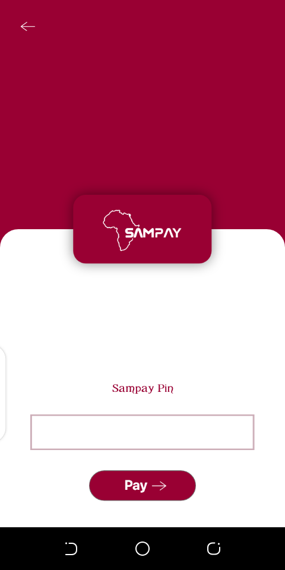

# sampay_payment_dialog
An easy way to add payments to your mobile applications




[](https://jitpack.io/#geraldPhiri/sampay_payment_dialog)


**Min SDK:** 16

## Installation

project_name/build.gradle
```
   repositories { 
        maven { url 'https://jitpack.io' }
   }
```
app/build.gradle
```
   dependencies {
         implementation 'com.github.geraldPhiri:sampay_payment_dialog:v1.0.0.0'
         implementation("com.squareup.okhttp3:okhttp:4.7.2")
   }
```


## Usage


```java
try {
            new PaymentDialog()
                    .setLink("https://samafricaonline.com/sam_pay/public/deliverypay/")
                    .setReceiver("+260973767938")
                    .setSender("+260977209444")
                    .setAmount("1.2")
                    .setPaymentCallback(new PaymentCallback() {
                        @Override
                        public void onFailureListener(final String msg) {
                            runOnUiThread(new Runnable() {
                                @Override
                                public void run() {
                                    Toast.makeText(getApplicationContext(),msg,Toast.LENGTH_SHORT).show();
                                }
                            });

                        }

                        @Override
                        public void onSuccessListener(final String msg) {
                            runOnUiThread(new Runnable() {
                                @Override
                                public void run() {
                                    Toast.makeText(getApplicationContext(),msg,Toast.LENGTH_SHORT).show();
                                }
                            });
                        }
                    })
                    .show(MainActivity.this);
        }
        catch (NegativeAmountException e){
            Toast.makeText(getApplicationContext(),e.toString(),Toast.LENGTH_SHORT).show();
        }
```
